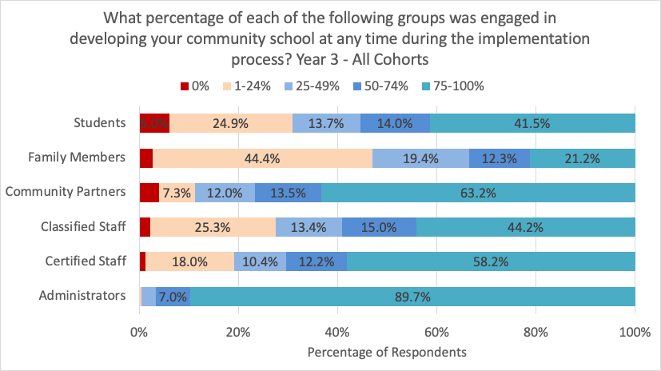
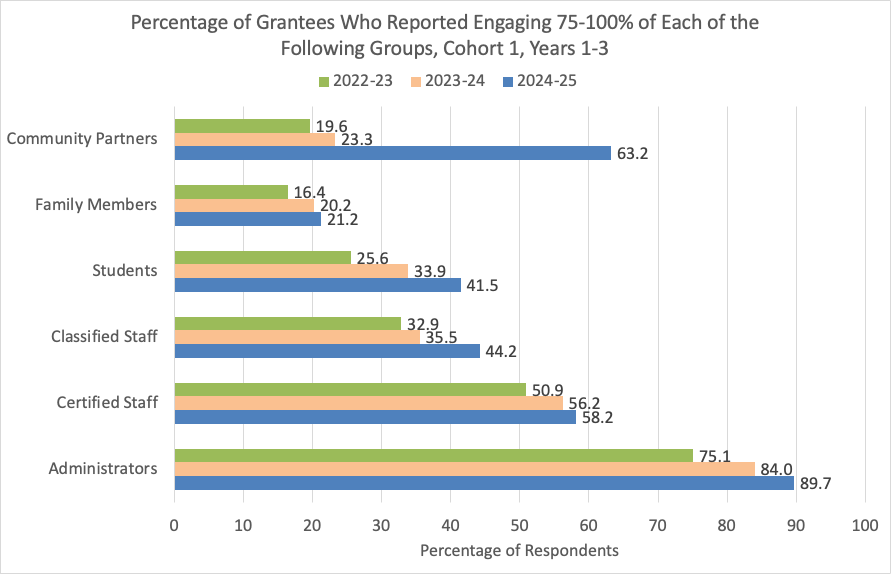
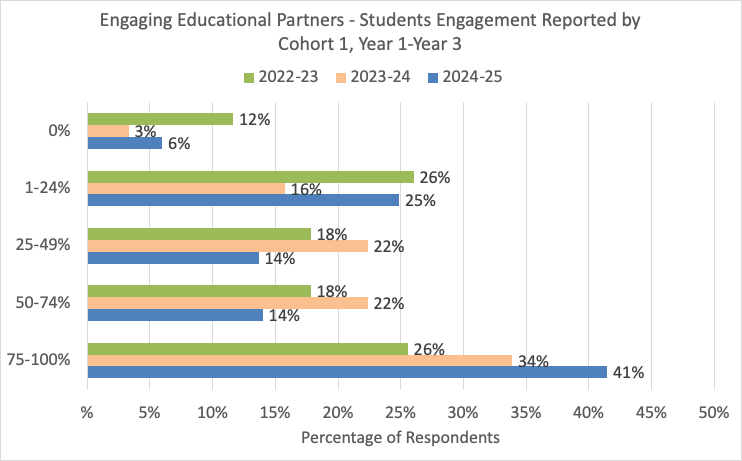
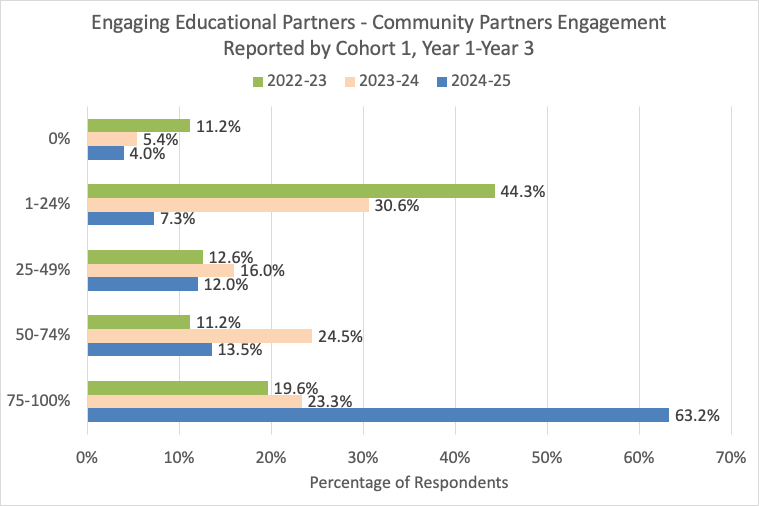
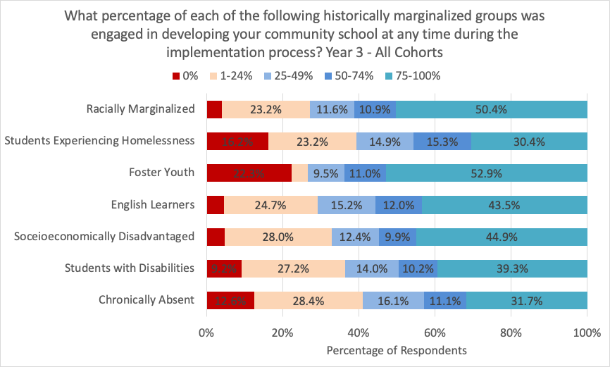

# Overview of Engaging Educational Partners in Year 3: QUESTION?

This section of the APR examines how schools collaborate with educational partners to advance teaching, learning, and student outcomes. The questions focus on the depth, quality, and purpose of partnerships in supporting school improvement as active contributors rather than as peripheral or transactional relationships.

Analysis of Year 3 APR data indicates that schools, across all three cohorts, were most successful in engaging administrators (89.7% at 75-100% engagement rate), certified staff (58.2% at 75-100% engagement rate), and classified staff (44.2% at 75-100% engagement rate) in community schools implementation. More than 60% of respondents also reported engaging 75-100% of community partners. While 6% of grantees in Year 3 indicated engaging students at a rate of 0%, longitudinal trends of Y1 through Y3 showed that engagement of students is increasing (see below).

For Internal Use only, some of these groups are **very high in NA’s**, which means many respondents did not fill it out. This is something our recent revisions (e.g., removed Community Members as a reporting category; added the definition of Community Partners) can help address in the upcoming year.

**Engagement Rates**

| Stakeholder Group  | 0%  | 1-24% | 25-49% | 50-74% | 75-100% | *NA*  |
|--------------------|-----|-------|--------|--------|---------|-------|
| Administrators     | 2   | 6     | 53     | 130    | 1664    | *64*  |
| Certified Staff    | 22  | 325   | 189    | 221    | 1052    | *110* |
| Classified Staff   | 39  | 457   | 241    | 270    | 797     | *115* |
| Community Members  | 386 | 560   | 17     | 4      | 9       | *943* |
| Community Partners | 52  | 95    | 157    | 177    | 827     | *661* |
| Family Members     | 45  | 761   | 333    | 210    | 364     | *206* |
| Students           | 104 | 431   | 237    | 243    | 719     | *185* |

# Y1-Y3 Trends

Across Cohort 1 schools (N=450?), we see steady increases in the percentage of grantees that reported engaging each group of interest holders at a rate of 75-100% each year. Year 3 APR shows particularly enhanced engagement of community partners, which increased by 44 percentage points from Year 1.

The following two graphsshowcase longitudinal trends of student and community partners engagement. Compared to previous years, the percentage of Cohort 1 grantees that reported engaging students and community partners at 0% dropped to the lowest in Year 3. Compared to Year 2, fewer Cohort 1 grantees in Year 3 reported engaging students at 25-74%. For student engagement, grantees moved from these middle categories to a lower (1-24%) or a higher engagement level (75-100%). For community partners engagement, the majority of Cohort 1 grantees moved up to the highest (75%) engagement level.

::: panel-tabset
### Students

### Community Partners

:::

# Historically Marginalized Groups

In Year 3, more than half of grantees reported engaging 75-100% of foster youth and racially marginalized students. However, foster youth and students experiencing homelessness are two groups where the highest percentage of grantees reported 0% engagement. In other words, ADD A SENTENCE HERE ABOUT HOW TO INTERPRET THIS.

