# Among the CCSPP schools, what are the academic, social-emotional, health, and family supports available to students and families?

## Overview of the *Whole-Child and Family Supports Inventory* in Year 3

This section of the APR captures the range and alignment of academic, social-emotional, health, and family supports available to students and families. The questions are designed to assess how well these supports are coordinated and responsive to local needs and assets.

The 27 supports in the inventory are divided into six categories, according to the nature of the support and the roles in the school community that engage with that support: Integrated Student Supports and Services; Community, Student & Family Engagement; Collaborative Leadership Practices; Expanded & Enriched Learning Time; Community-based Curriculum & Pedagogy, and; Positive & Restorative School Climate. Each category is presented in a different section below. For each support identified under the category, grantees were asked to identify those that were part of their implementation plan.

INSERT TABLE OF ALL 6 SUPPORTS HERE, FOR YEAR 3?

# Year 3 Overview for Cohorts 1-3


## I. Integrated Student Supports and Services

::: panel-tabset
### A. Availability/Presence

In Year 3, 87% of grantees indicated that Mental Health Screening Services were part of their implementation plan. Multi-Tiered System of Support were identified by 84% of grantees as a critical offering.

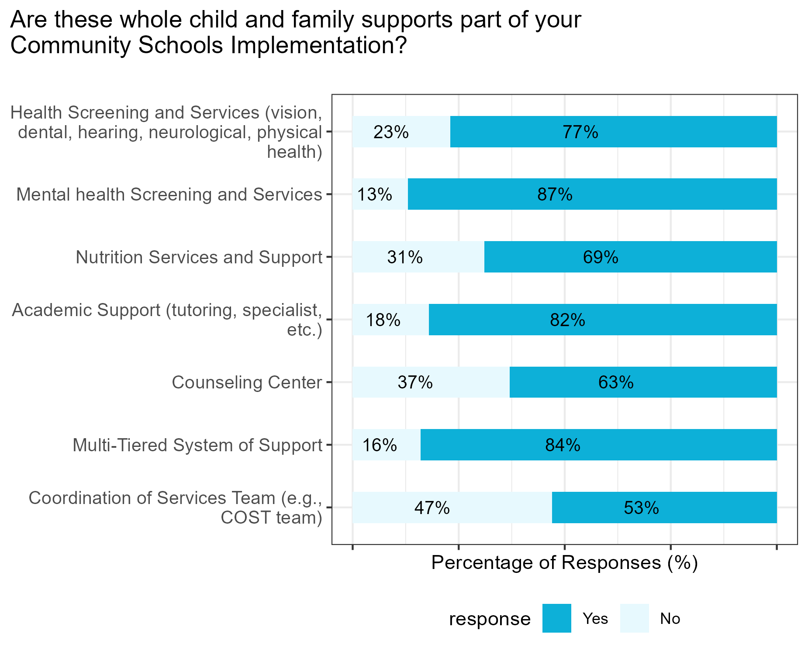{fig-align="center"}

### B. Implementation of the Supports/Service

A majority of the Integrated Student Supports and Services offered by grantees in Year 3 were previously offered prior to the CCSPP and integrated into their community schools work. Over 80% of grantees indicated that they previously implemented each of the supports. One exception is the Coordination of Services Team (e.g., COST team), with 25% of grantees indicating that implementation was the result of CCSPP funding.

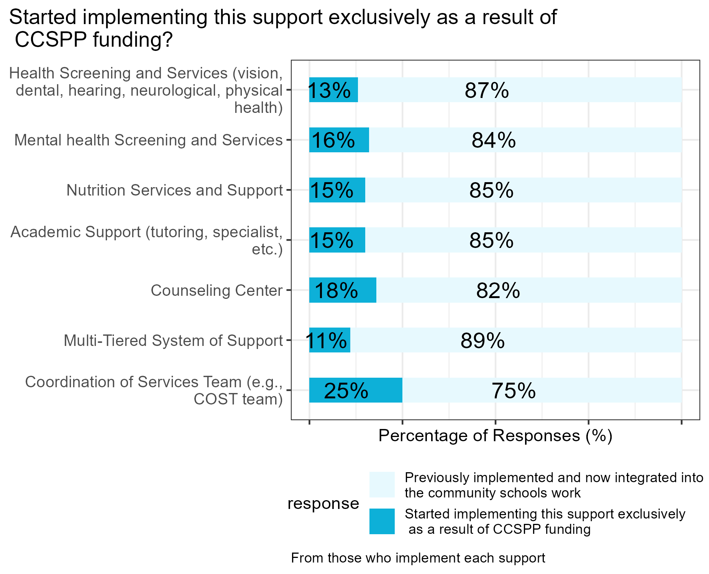{fig-align="center"}

### C. Served individuals by Support/Service

Grantees were asked the number of individuals that were served by each support. In Year 3 of the CCSPP Implementation Grant, for those support that are grouped around the presence of integrated student supports and services, it is possible to see that *...*.

{fig-align="center"}

### D. Support/Service Funding

To fund these supports and services, grantees were asked to report funding sources beyond CCSPP to sustain the support long-term. Grantees tapped into traditional funding sources, such as *LCFF to support their Multi-Tiered System of Support (25% of grantees)* and *Title I to support offerings of Academic Supports (14% of grantees) and the Multi-Tiered System of Support.* *Expanded Learning Opportunities Program (ELOP) is also used to support offerings of Academic Supports (15% of Grantees)*.

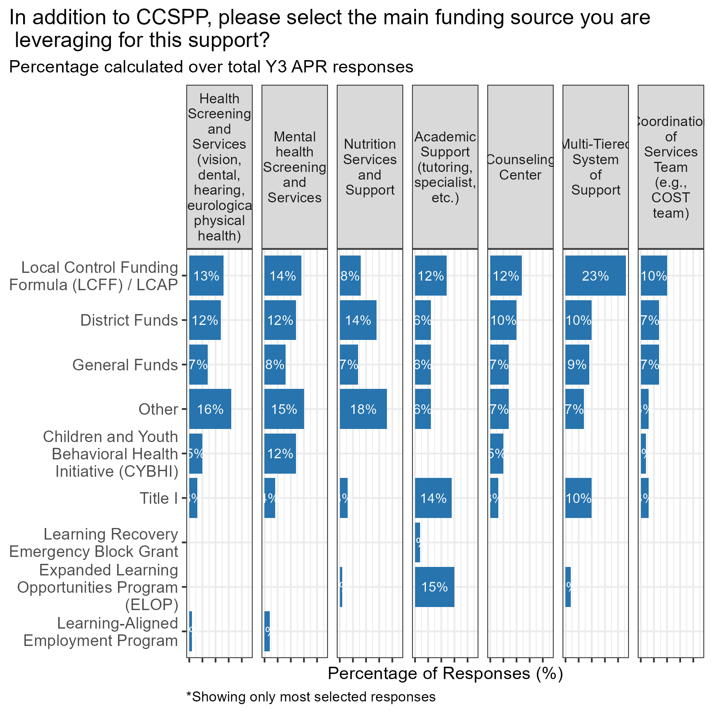{fig-align="center"}
:::

## II. Community, Student, and Family Engagement

::: panel-tabset
### A. Availability/Presence

For supports that are categorized as Community, Student, and Family Engagement supports/services, **90% of grantees indicated implementing Multiple Modes of Family Communication and Involvement.** Approximately **two-thirds of grantees indicated that they were implementing Home Visits in Year 3.**

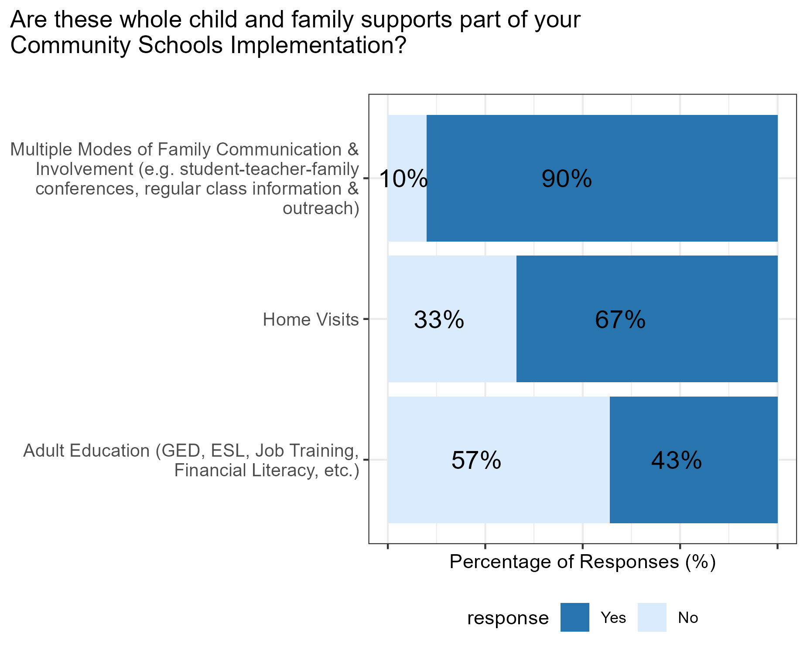{fig-align="center"}

### B. Implementation of the Support/Services

Grantees indicated that providing supports and services that aimed to engage students, families, and community was integrated into their community schools work. *Almost one-third of grantees indicated that the provision of Adult Education programs was made possible through CCSPP.*

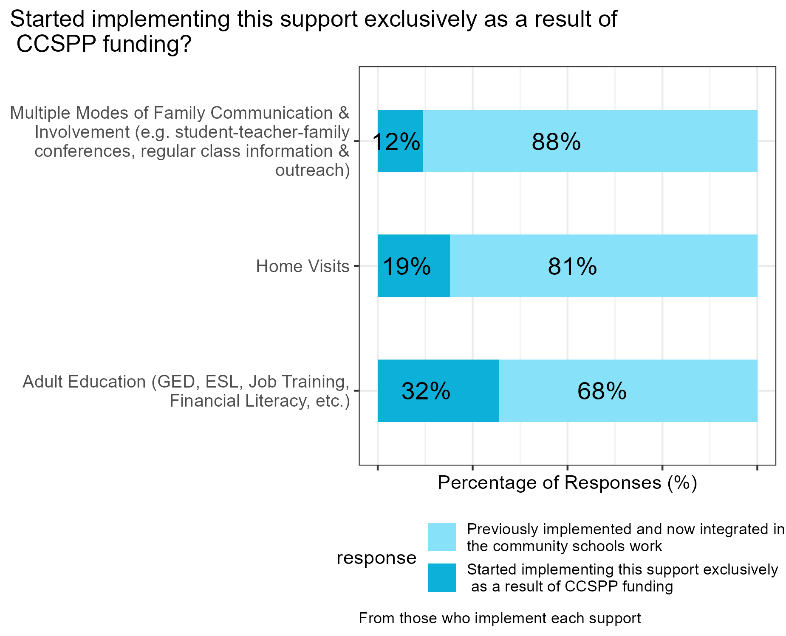{fig-align="center"}

### C. Individuals served by Support/Service

Grantees were asked the number of individuals that were served by each support. In Year 3 of the CCSPP Implementation Grant, for those support that are grouped around Community, Student, and Family Engagement, it is possible to see that *NA*

{fig-align="center"}

### D. Supports funding

For those supports/services that are categorized under Community, Student, and Family Engagement, *LCFF is used frequently to fund the Multiple Modes of Family Communication and Involvement and to support Home Visits*.

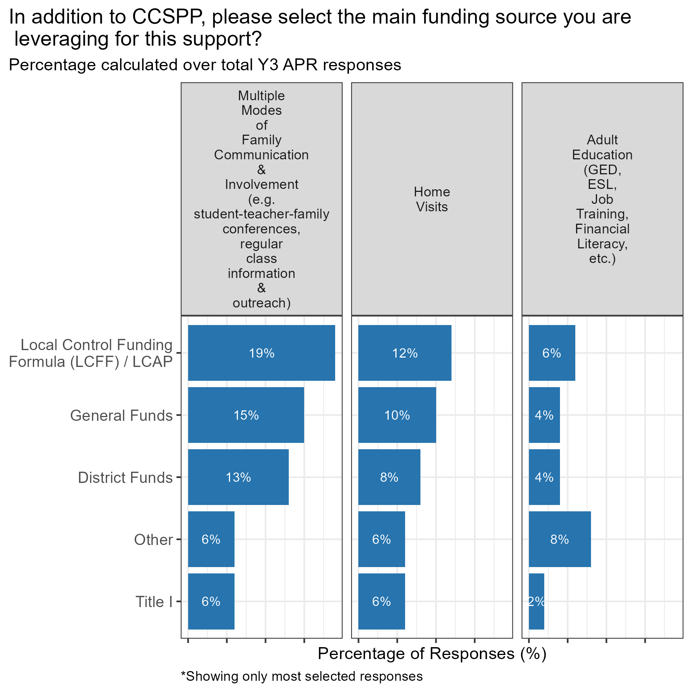{fig-align="center"}
:::

## III. Collaborative Leadership Practices

::: panel-tabset
### A. Availability/Presence of the Support/Service

For those supports/services that are grouped under the category of Collaborative Leadership Practices *89% of grantees have implemented and formed a shared decision-making body that aims to center the voices of all community members, including students, families, and other interest-holders*.

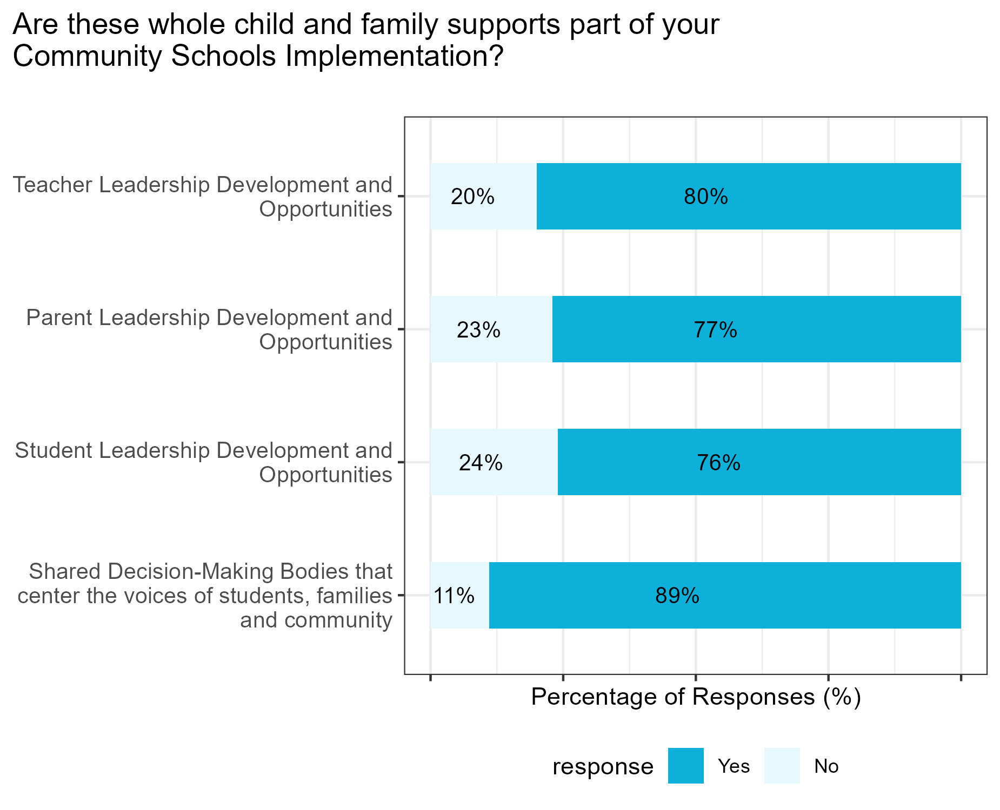{fig-align="center"}

### B. Implementation of the Support/Services

For those support that are grouped under the category of Collaborative Leadership practices, *31% of grantees started implementing Parent Leadership Development Opportunities exclusively because the CCSPP funding*. In addition, *28% of grantees mention starting the Shared decision-making bodies exclusively as a result of CCSPP funding*.

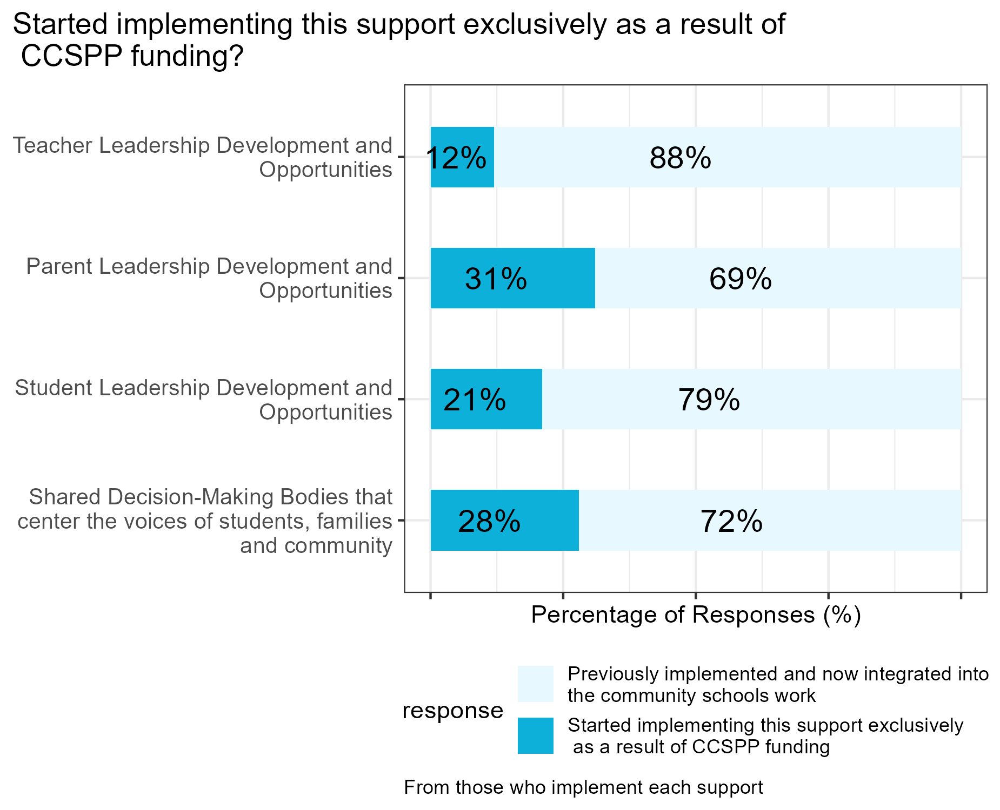{fig-align="center"}

### C. Served individuals

Grantees were asked the number of individuals that were served by each support. For those supporta that are grouped under Collaborative Leadership Practices, it is possible to see that *...*.

{fig-align="center"}

### D. Supports funding

For those support that are grouped under Collaborative Leadership practices, *Teacher Leadership Development and Opportunities are being funded by a diversity of sources --such as LCFF, General Funds, Title I, among others*. In addition, newly implemented *Shared Decision-Making Bodies are being funded by many sources, including the LCFF, General Funds, Title I funds, and District Funds*.

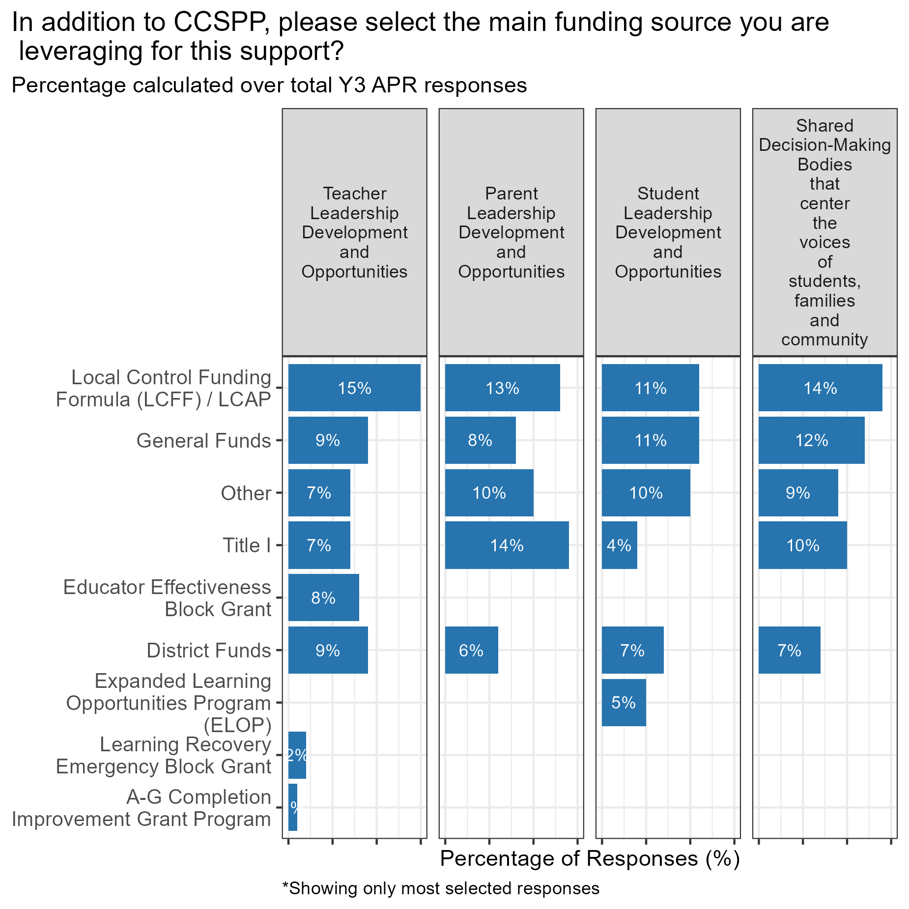{fig-align="center"}
:::

## IV. Expanded and Enriched Learning Time

::: panel-tabset
### A. Presence of the Supports/Services

For those support that are grouped under the category of Expanded and Enriched Learning Time, *78% of grantees implemented After School programs*.

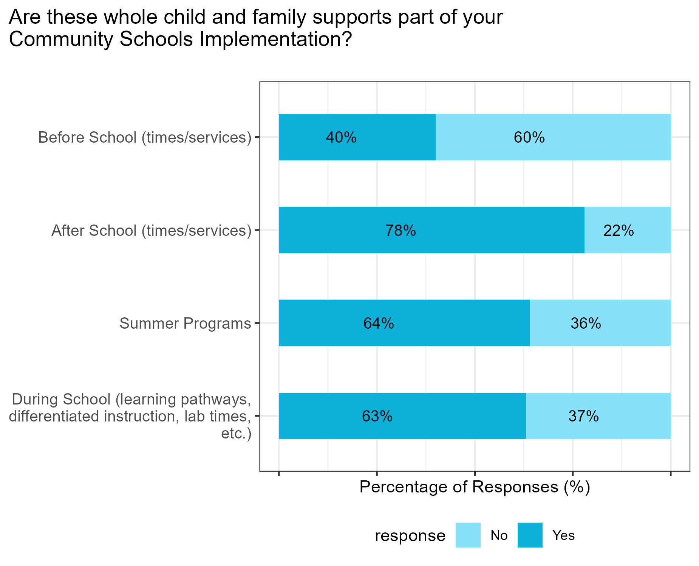{fig-align="center"}

### B. Implementation of the Supports/Services

For those support/services that are grouped under the category of Expanded and Enriched Learning Time, *15% of grantees mention starting Before School programs exclusively as a result of CCSPP funding*.

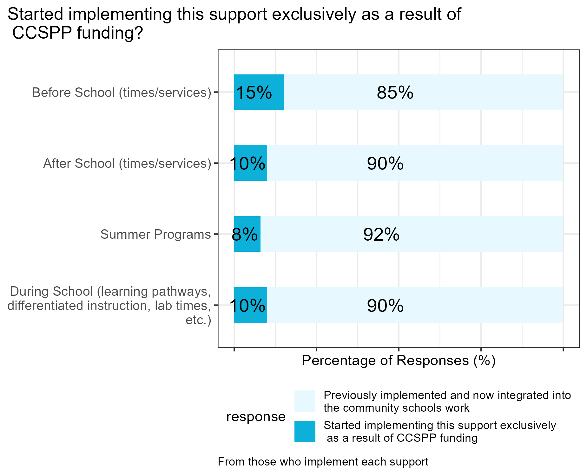{fig-align="center"}

### C. Served individuals

For those supports/services that are grouped under the category of Expanded and Enriched Learning Time, it is possible to see that *NA*.

{fig-align="center"}

### D. Supports funding

For those support that are grouped under the category of Expanded and Enriched Learning Time, *Expanded Learning Opportunities Program (ELOP) is the main funding source for After School programs and Summer Programs*.

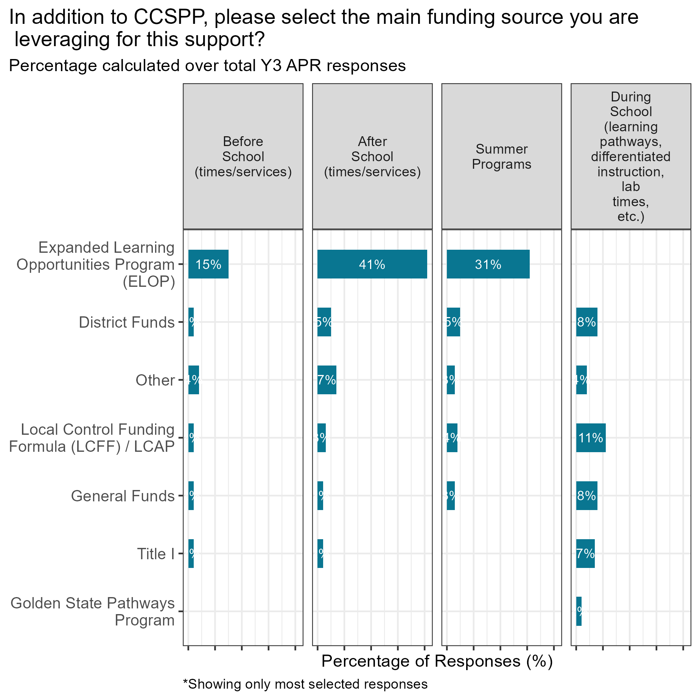{fig-align="center"}
:::

## V. Community-based Curriculum and Pedagogy

::: panel-tabset
### A. Availability/Overview of the Presence of the Support/Service

For those support that fall under the category of Community-based Curriculum and Pedagogy Practices, *56% of grantees mention implementing a Culturally-Sustaining and Responsive Curriculum and Pedagogy*.

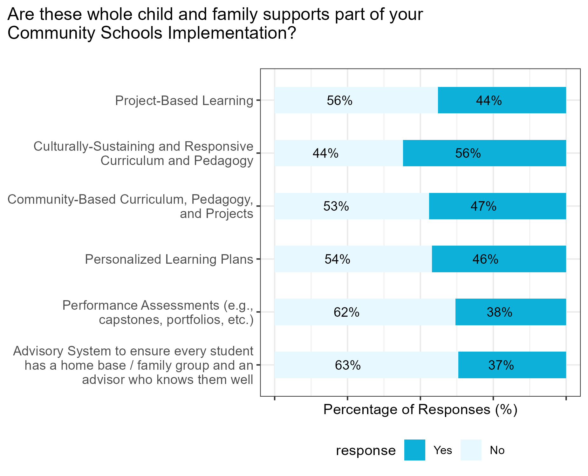{fig-align="center"}

### B. Implementation of the Support/Services

For those supports that are categorized under Community-based Curriculum and Pedagogy Practices, *27% of grantees mention that they started implementing Community-Based Curriculum, Pedagogy and Projects exclusively as a result of the CCSPP funding*.

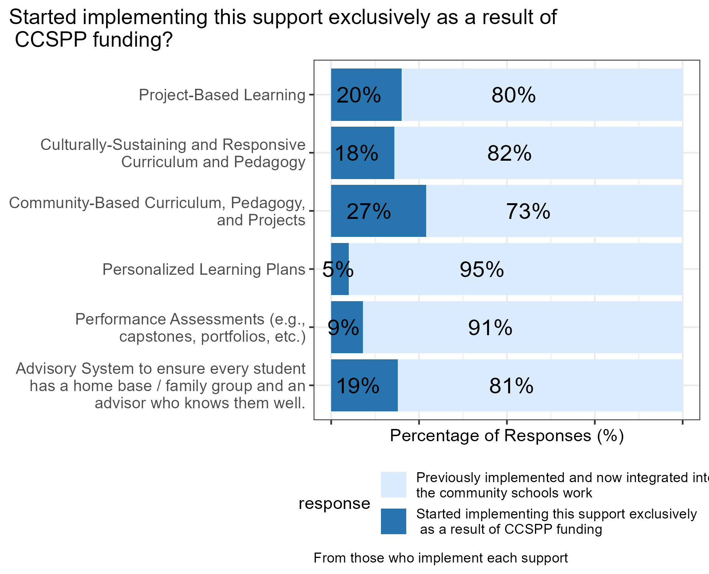{fig-align="center"}

### C. Served Individuals

For those support that are grouped under the category of Community-based Curriculum and Pedagogy Practices, *...*.

{fig-align="center"}

More specifically ...

### D. Supports/Services Funding

For those support that are categorized under Community-based Curriculum and Pedagogy Practices, *grantees are using a diversity of funding sources. In particular,...*.

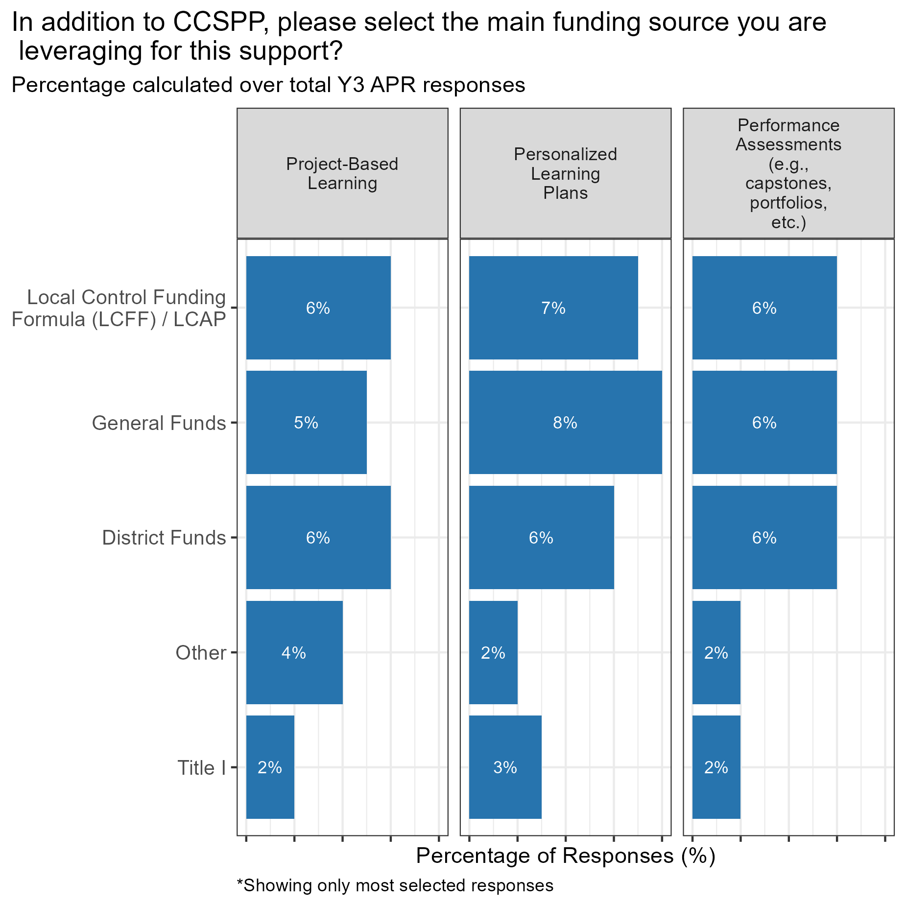{fig-align="center"}
:::

## VI. Positive and Restorative School Climate

::: panel-tabset
### A. Availability/Overview of the Presence of the Support/Service

For those supports/services that are categorized under Positive and Restorative School Climate, *89% of grantees mention implementing Programs and Practices that Teach Social-Emotional Skills*.

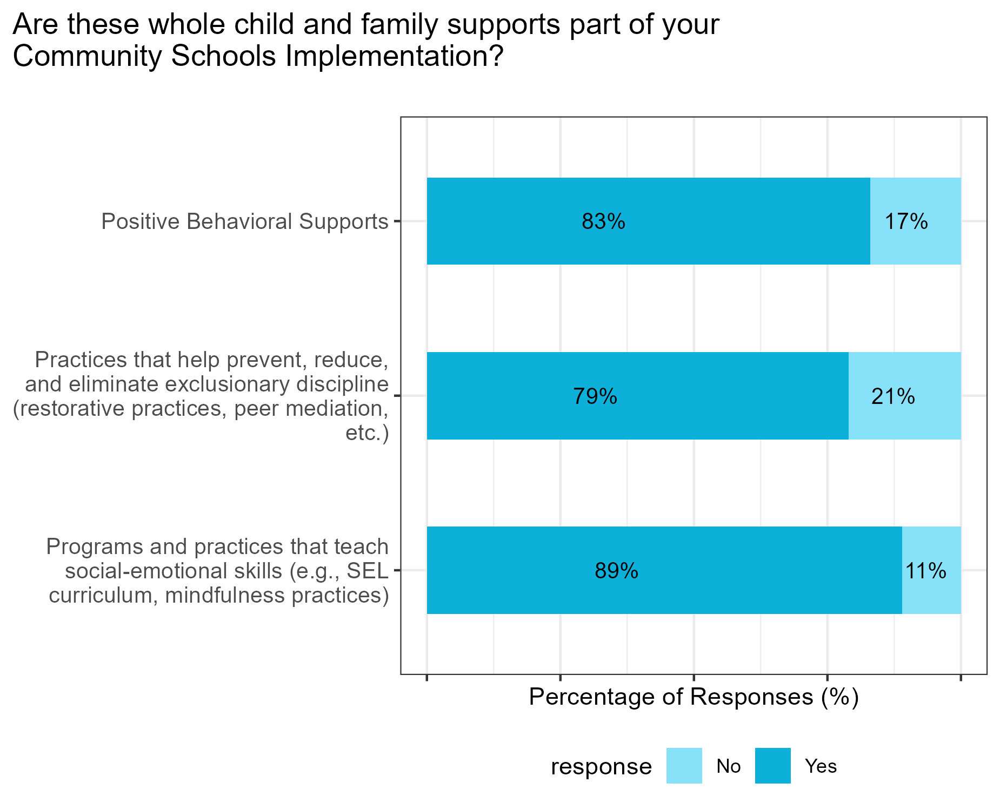{fig-align="center"}

### B. Implementation of the Support/Services

Grantees were asked when did they start implementing each support. For those support that are grouped under Positive and Restorative School Climate, *16% of grantees mention that the Programs and Practices that Teach Social-Emotional Skills that they implemented started exclusively as a result of CCSPP funding*.

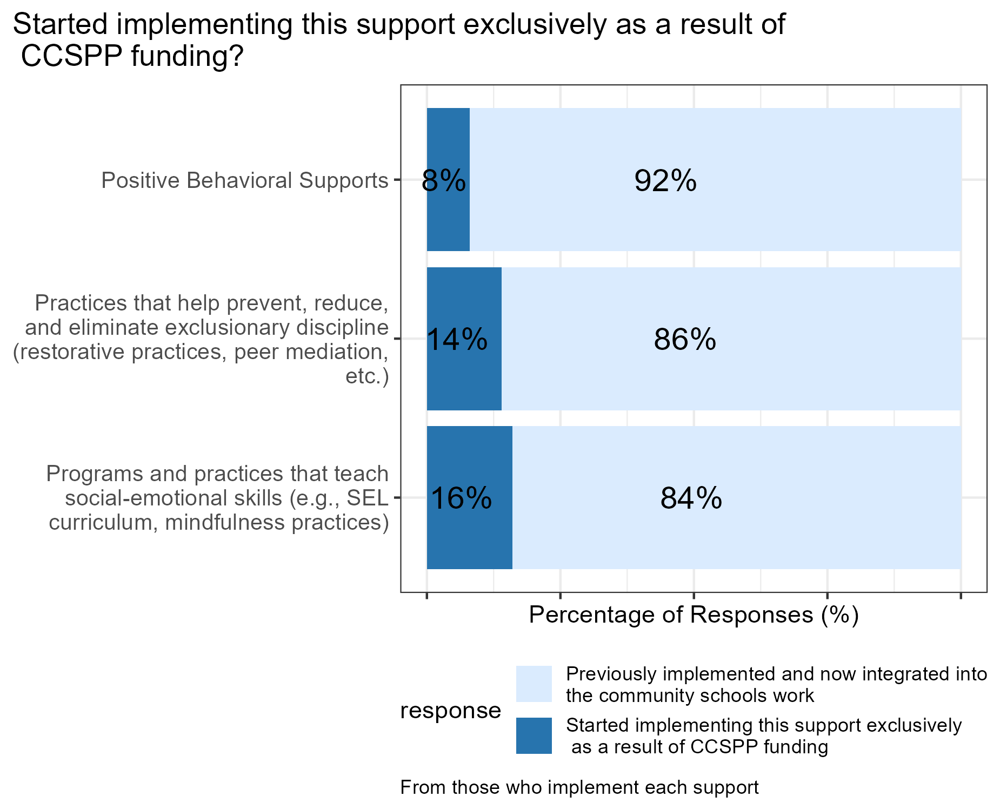{fig-align="center"}

### C. Served individuals by support

For those support that are grouped around Positive and Restorative School Climate,... *NA*.

{fig-align="center"}

### D. Supports funding

For those supports that are grouped under Positive and Restorative School Climate, it is possible to see that *grantees are using the LCFF as the main source to fund supports related to Positive and Restorative School Climate*.

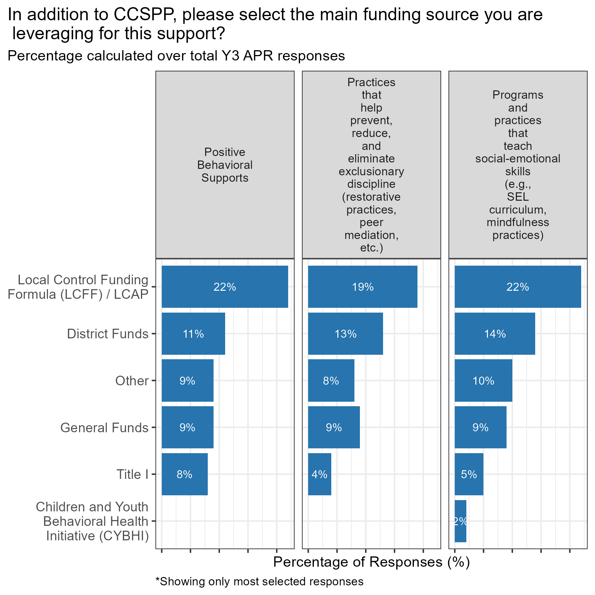{fig-align="center"}
:::

# Y1-Y3 Trends

```{=html}
<div class='tableauPlaceholder' id='viz1769936550238' style='position: relative'><noscript><a href='#'></a></noscript><object class='tableauViz'  style='display:none;'><param name='host_url' value='https%3A%2F%2Fpublic.tableau.com%2F' /> <param name='embed_code_version' value='3' /> <param name='site_root' value='' /><param name='name' value='WCFSITableau&#47;WCFSITableau' /><param name='tabs' value='no' /><param name='toolbar' value='yes' /><param name='static_image' value='https:&#47;&#47;public.tableau.com&#47;static&#47;images&#47;WC&#47;WCFSITableau&#47;WCFSITableau&#47;1.png' /> <param name='animate_transition' value='yes' /><param name='display_static_image' value='yes' /><param name='display_spinner' value='yes' /><param name='display_overlay' value='yes' /><param name='display_count' value='yes' /><param name='language' value='en-US' /><param name='filter' value='publish=yes' /></object></div>                <script type='text/javascript'>                    var divElement = document.getElementById('viz1769936550238');                    var vizElement = divElement.getElementsByTagName('object')[0];                    if ( divElement.offsetWidth > 800 ) { vizElement.style.width='1000px';vizElement.style.height='827px';} else if ( divElement.offsetWidth > 500 ) { vizElement.style.width='1000px';vizElement.style.height='827px';} else { vizElement.style.width='100%';vizElement.style.height='727px';}                     var scriptElement = document.createElement('script');                    scriptElement.src = 'https://public.tableau.com/javascripts/api/viz_v1.js';                    vizElement.parentNode.insertBefore(scriptElement, vizElement);                </script>
```
