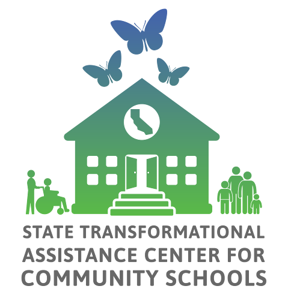

# California Community Schools Partnership Program Annual Progress Report

## Results Portal

**The Annual Progress Report serves as a tool to assess implementation progress and efforts, and to encourage reflection as part of an ongoing continuous improvement process.** The APR was designed to be filled out by each school's CCSPP shared decision-making team or council to ensure the perspectives of students, staff, families and community partners are captured. The reporting portal is intended to align with required annual update presentations on community school planning, including data and outcomes from the prior year at each school site.

The APR is aligned with the California Community Schools Framework and also aligns with resources provided by the State Transformational Assistance Center (S-TAC) including the Community Schools Implementation Plan Template, the Community Schools Needs and Assets Assessment (NAA) Guide ([full](https://cadigitalcommons.org/wp-content/uploads/2025/06/Deep-Needs-and-Asset-Assessment.pdf) and [condensed](https://cadigitalcommons.org/wp-content/uploads/2025/06/Needs-and-Assets-Assessment-Condensed.pdf) versions), the Capacity Building Strategies: A Developmental Rubric ([English](https://drive.google.com/file/d/1enPndjBIb1U8qE2I-pbOOxhw0n5Robgm/view?usp=sharing) and [Spanish](https://drive.google.com/file/d/1xwGta6v6V9Ib9Lmg3fI2FanKoNtEPqQI/view) versions), and the Capacity-Building Strategies: Self-Assessments ([LEA](https://docs.google.com/forms/d/e/1FAIpQLSdcH3LNxkDwyvIk_gppRtpNWwfiOEIjXn0z5QTgOqBknGu_lQ/viewform) and [Site-level](https://docs.google.com/forms/d/e/1FAIpQLSc5DZgLk-vQy-woKBKLm49a4QzHU9YAFCF1oBO0h-w63NDepA/viewform?usp=send_form) versions) that are available for optional use by grantees.

These visualizations reflect the data from the CCSPP APR for school sites for the **2022-2023, 2023- 2024, and the 2024-2025 school.**

**INSERT OVERALL FINDINGS HERE?**

Select specific APR report by **clicking on the section above**.

|                                                          |
|:--------------------------------------------------------:|
| {width="398"} |
|          {width="188"}          |
